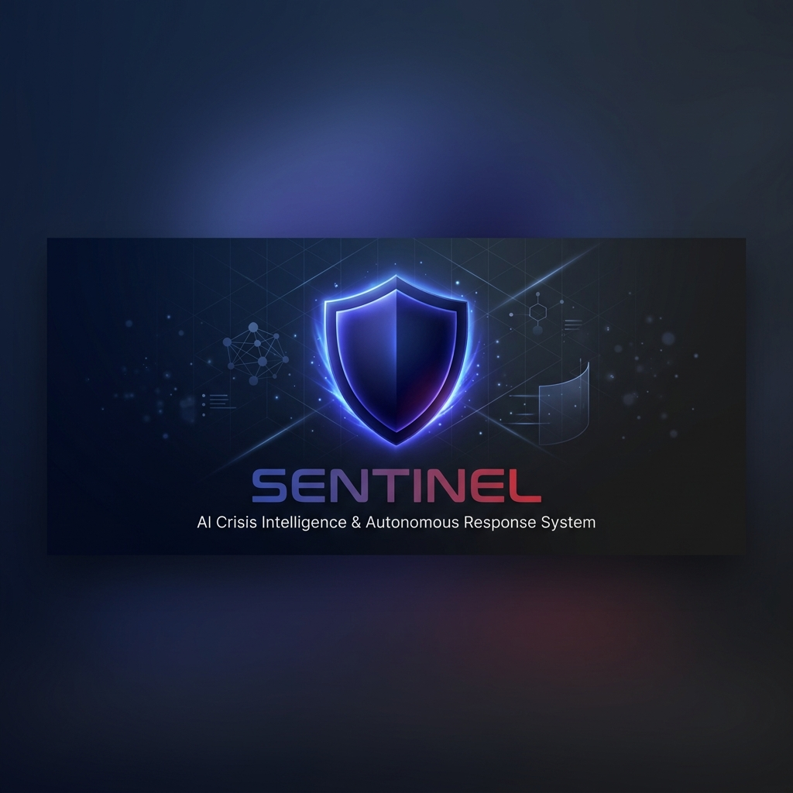
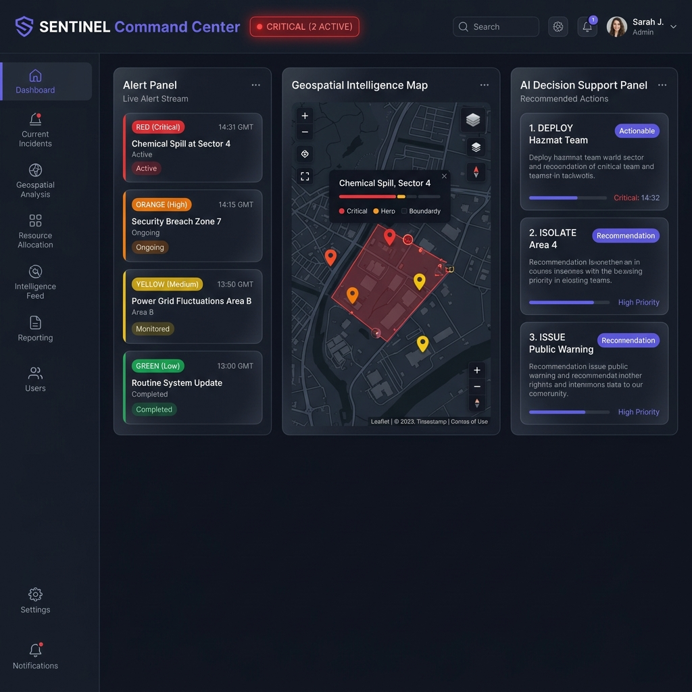
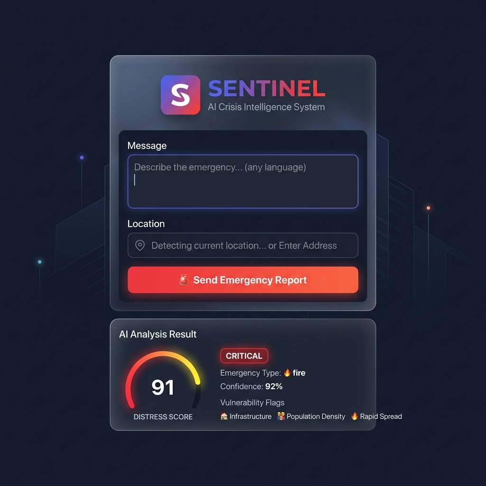
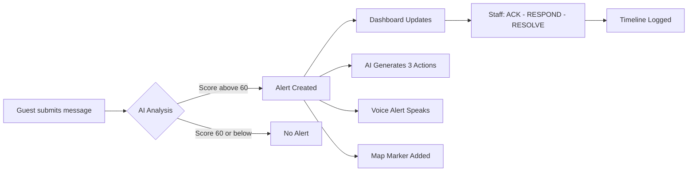

<div align="center">



<br><br>

### AI Crisis Intelligence & Autonomous Response System

Real-time AI-powered crisis detection and response platform with local LLM,  
pose detection, multilingual support, and autonomous decision-making.

[](https://python.org)
[](https://fastapi.tiangolo.com)
[](https://react.dev)
[](https://vite.dev)
[](https://tailwindcss.com)
[](https://firebase.google.com)
[](https://ollama.ai)
[](LICENSE)

<br>

[🚀 Quick Start](#-quick-start) · [✨ Features](#-feature-highlights) · [📡 API](#-api-reference) · [🔧 Setup](#-optional-setup) · [🤝 Contributing](CONTRIBUTING.md)

</div>

---

## 🖥️ Preview

<div align="center">

| Staff Command Dashboard | Guest Emergency Portal |
|:-----------------------:|:----------------------:|
|  |  |
| Real-time alerts · AI decisions · Incident map | Emergency report form · Distress analysis · Severity meter |

</div>

---

## ✨ Feature Highlights

<table>
<tr>
<td width="50%">

### 🆘 Detection & Analysis
- **Silent SOS Detection** — Distress scoring (0–100)
- **Multilingual Interpreter** — Any language → English
- **Pose-Based Panic Detection** — Camera + MediaPipe
- **False Alarm Scoring** — Confidence filtering
- **Context Memory** — Last 3 alerts improve AI

</td>
<td width="50%">

### 🛡️ Response & Monitoring
- **AI Decision Engine** — 3 actions per alert
- **Live Command Dashboard** — Real-time severity
- **Incident Map** — Leaflet with dark tiles
- **Voice Alerts** — Web Speech API for critical
- **Vulnerability Detection** — Child, elderly, injured

</td>
</tr>
</table>

---

## 🏗️ Architecture

```
┌─────────────────┐     ┌──────────────────┐     ┌──────────────────┐
│   Guest Portal   │────▶│   FastAPI Server  │────▶│   Ollama LLM     │
│   (React + Vite) │     │   (Python)        │     │   (llama3)       │
└─────────────────┘     └──────┬───────────┘     └──────────────────┘
                               │                          │
┌─────────────────┐            │                   ┌──────▼──────────┐
│   Camera Panel   │───────────┤                   │  Fallback AI    │
│   (MediaPipe)    │           │                   │  (keyword-based)│
└─────────────────┘            │                   └─────────────────┘
                               │
┌─────────────────┐     ┌──────▼───────────┐
│ Staff Dashboard  │◀───│ Firebase RTDB /   │
│ (Real-time)      │    │ In-Memory Store   │
└─────────────────┘     └──────────────────┘
```

---

## ⚙️ Tech Stack

| Layer | Technology |
|:------|:-----------|
| **Frontend** | React 19 + Vite 8 + Tailwind CSS 4 |
| **Backend** | Python FastAPI + Uvicorn |
| **AI** | Ollama (local LLM, llama3) + Keyword Fallback |
| **Maps** | Leaflet + React-Leaflet (dark tiles) |
| **Vision** | MediaPipe Pose (browser, CDN) |
| **Voice** | Web Speech API |
| **Database** | Firebase RTDB / In-Memory fallback |
| **Auth** | Firebase Auth / Skip mode |

---

## 📦 Project Structure

```
SENTINEL/
├── .env.example              # Environment variable template
├── LICENSE                    # MIT License
├── CONTRIBUTING.md            # Contribution guidelines
├── SECURITY.md                # Security policy
├── README.md
├── firebase.json              # Firebase Hosting config
│
├── assets/                    # README images
│   ├── sentinel-banner.png
│   ├── dashboard-preview.png
│   └── guest-portal-preview.png
│
├── backend/
│   ├── main.py                # FastAPI server (7 endpoints)
│   ├── models.py              # Pydantic request/response schemas
│   ├── ollama_client.py       # Ollama LLM + fallback engine
│   ├── firebase_client.py     # Firebase Admin + local store
│   └── requirements.txt       # Python dependencies
│
└── frontend/
    ├── index.html             # HTML entry + MediaPipe CDN
    ├── vite.config.js         # Vite + Tailwind + proxy
    ├── package.json           # NPM dependencies
    ├── public/
    │   └── sentinel-logo.svg  # App favicon
    └── src/
        ├── main.jsx           # React entry
        ├── App.jsx            # Router
        ├── index.css          # Dark theme + animations
        ├── firebase/
        │   └── config.js      # Firebase SDK config (via env vars)
        ├── hooks/
        │   ├── useAlerts.js   # Real-time alert listener
        │   └── useVoiceAlert.js # Web Speech API
        ├── utils/
        │   ├── localAnalyzer.js # Browser-side distress analyzer
        │   └── poseDetection.js # Pose analysis algorithms
        ├── components/
        │   ├── Sidebar.jsx        # Navigation sidebar
        │   ├── AlertPanel.jsx     # Alert list with severity badges
        │   ├── MapPanel.jsx       # Leaflet incident map
        │   ├── DecisionPanel.jsx  # AI action recommendations
        │   ├── CameraPanel.jsx    # MediaPipe pose detection
        │   ├── IncidentLog.jsx    # Timeline event log
        │   ├── ScenarioSwitcher.jsx # Test scenario triggers
        │   ├── SeverityMeter.jsx  # Dynamic severity gauge
        │   ├── VoiceAlert.jsx     # TTS alert control
        │   ├── ResponseTimer.jsx  # Elapsed time tracker
        │   └── VulnerabilityBadge.jsx # Vulnerability flags
        └── pages/
            ├── GuestPortal.jsx    # Public emergency form
            ├── StaffDashboard.jsx # Main command center
            ├── CameraPage.jsx     # Camera monitoring
            ├── IncidentsPage.jsx  # Incident history
            └── Login.jsx          # Authentication
```

---

## 🚀 Quick Start

### Prerequisites

| Tool | Version | Required |
|:-----|:--------|:---------|
| **Node.js** | 18+ | ✅ Yes |
| **Python** | 3.9+ | ✅ Yes |
| **Ollama** | latest | ⚡ Optional (fallback works without it) |

### 1️⃣ Clone the Repository

```bash
git clone https://github.com/mirani9/Soln.git
cd Soln
```

### 2️⃣ Setup Environment Variables

```bash
# Copy the template
cp .env.example frontend/.env

# Edit frontend/.env and add your Firebase credentials
```

> [!NOTE]
> The system works **without Firebase** — it falls back to an in-memory store automatically.

### 3️⃣ Install & Start Backend

```bash
cd backend
pip install -r requirements.txt
python main.py
```

The server starts at `http://localhost:8000`:

```
SENTINEL API starting...
   Ollama: Not available (using fallback)
   Firebase: Not configured (using local store)
   Server ready at http://localhost:8000
```

### 4️⃣ Install & Start Frontend

```bash
cd frontend
npm install
npm run dev
```

Frontend starts at `http://localhost:5173`

### 5️⃣ Open in Browser

| Page | URL | Description |
|:-----|:----|:------------|
| 🆘 **Guest Portal** | http://localhost:5173/guest | Public emergency report form |
| 🛡️ **Staff Dashboard** | http://localhost:5173/dashboard | Real-time command center |
| 📹 **Camera Page** | http://localhost:5173/camera | Pose detection monitoring |
| 📋 **Incident Log** | http://localhost:5173/incidents | Full timeline history |
| 🔐 **Login** | http://localhost:5173/login | Staff authentication |

---

## 🔧 Optional Setup

### Enable Ollama (Local AI)

1. Install [Ollama](https://ollama.ai)
2. Pull the model:
   ```bash
   ollama pull llama3
   ```
3. Start Ollama server (runs on port 11434 by default)
4. Restart the backend — it will auto-detect Ollama

### Enable Firebase

<details>
<summary><strong>🔧 Backend — Firebase Admin SDK</strong></summary>

1. Go to [Firebase Console](https://console.firebase.google.com)
2. Create a project → Project Settings → Service Accounts
3. Generate a new private key (JSON)
4. Save as `backend/serviceAccountKey.json`
5. Restart the backend

</details>

<details>
<summary><strong>🔧 Frontend — Firebase Client SDK</strong></summary>

1. Firebase Console → Project Settings → General → Your apps → Add web app
2. Copy the config values
3. Paste into `frontend/.env` (see `.env.example` for the variable names)
4. Enable Authentication (Email/Password + Google) in Firebase Console
5. Create a Realtime Database (start in test mode)

</details>

### Environment Variables Reference

| Variable | Used In | Description |
|:---------|:--------|:------------|
| `VITE_FIREBASE_API_KEY` | Frontend | Firebase API key |
| `VITE_FIREBASE_AUTH_DOMAIN` | Frontend | Firebase auth domain |
| `VITE_FIREBASE_DATABASE_URL` | Frontend | Realtime Database URL |
| `VITE_FIREBASE_PROJECT_ID` | Frontend | Firebase project ID |
| `VITE_FIREBASE_STORAGE_BUCKET` | Frontend | Storage bucket |
| `VITE_FIREBASE_MESSAGING_SENDER_ID` | Frontend | Cloud Messaging sender ID |
| `VITE_FIREBASE_APP_ID` | Frontend | Firebase app ID |
| `CORS_ORIGINS` | Backend | Allowed CORS origins (comma-separated) |
| `OLLAMA_URL` | Backend | Ollama API endpoint |
| `OLLAMA_MODEL` | Backend | LLM model name |
| `FIREBASE_SERVICE_ACCOUNT_PATH` | Backend | Path to service account JSON |
| `FIREBASE_DATABASE_URL` | Backend | Override database URL |

---

## 📡 API Reference

| Endpoint | Method | Description |
|:---------|:-------|:------------|
| `/health` | `GET` | System health check |
| `/analyze-text` | `POST` | Analyze message for distress |
| `/decision` | `POST` | Generate 3 AI response actions |
| `/pose-alert` | `POST` | Trigger alert from camera |
| `/update-alert` | `PUT` | Update alert status |
| `/alerts` | `GET` | Get all alerts |
| `/timeline` | `GET` | Get all timeline events |
| `/scenario/{type}` | `POST` | Trigger test scenario (`fire` / `medical` / `threat`) |

<details>
<summary><strong>📋 Example: Analyze Text</strong></summary>

```bash
curl -X POST http://localhost:8000/analyze-text \
  -H "Content-Type: application/json" \
  -d '{"message": "Help! There is a fire on the 3rd floor!", "location": "Building A"}'
```

**Response:**
```json
{
  "distress_score": 91,
  "emergency_type": "fire",
  "severity": "critical",
  "confidence": 0.64,
  "alert_triggered": true,
  "vulnerability_flags": ["child"],
  "recommended_staff_role": "firefighter"
}
```

</details>

<details>
<summary><strong>📋 Example: Pose Alert</strong></summary>

```bash
curl -X POST http://localhost:8000/pose-alert \
  -H "Content-Type: application/json" \
  -d '{"pose_type": "falling", "confidence": 0.92, "location": "Lobby Camera 3"}'
```

**Response:**
```json
{
  "alert_id": "alert_20260430_010000_1",
  "status": "new",
  "emergency_type": "medical",
  "severity": "critical"
}
```

</details>

<details>
<summary><strong>📋 Example: AI Decision</strong></summary>

```bash
curl -X POST http://localhost:8000/decision \
  -H "Content-Type: application/json" \
  -d '{"alert_id": "alert_1", "emergency_type": "fire", "severity": "critical", "distress_score": 91}'
```

**Response:**
```json
{
  "actions": [
    "Dispatch fire brigade to location immediately",
    "Evacuate building and nearby areas now",
    "Alert hospitals for burn injury patients"
  ],
  "alert_id": "alert_1",
  "reasoning": "Generated 3 actions for fire (critical)"
}
```

</details>

---

## 🎨 UI Design System

| Element | Style |
|:--------|:------|
| **Theme** | Dark mode with glassmorphism |
| **Colors** | 🔴 Critical · 🟠 High · 🟡 Medium · 🟢 Low |
| **Animations** | Slide-in · Pulse · Shake · Gradient shift |
| **Font** | Inter (Google Fonts) |
| **Accents** | Indigo (#6366f1) + Red (#ef4444) gradient |
| **Layout** | Responsive with collapsible sidebar |
| **Updates** | 3-second polling / Firebase real-time listener |

---

## 🔄 System Flow



---

## 🔒 Security

- All credentials loaded from **environment variables** (`.env`)
- Zero hardcoded API keys in source code
- Firebase service account keys are **gitignored**
- Configurable CORS origins via `CORS_ORIGINS` env var
- See [SECURITY.md](SECURITY.md) for the full security policy

---

## 🤝 Contributing

Contributions are welcome! Please read the [Contributing Guidelines](CONTRIBUTING.md) first.

1. Fork the repo
2. Create your branch (`git checkout -b feature/amazing-feature`)
3. Commit changes (`git commit -m 'feat: add amazing feature'`)
4. Push to branch (`git push origin feature/amazing-feature`)
5. Open a Pull Request

---

## 📄 License

This project is licensed under the [MIT License](LICENSE).

---

<div align="center">

**Built with ❤️ for crisis response**

*All AI processing runs locally — no data leaves your machine*

<sub>SENTINEL v1.0 · Python · React · FastAPI · Ollama · MediaPipe · Firebase</sub>

</div>
